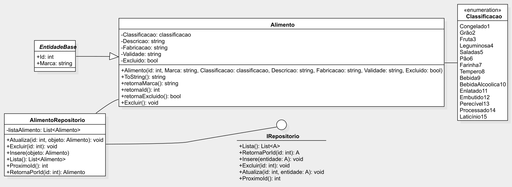

# DIO Estoque de Alimentos - Food Archive for Digital Innovation One (DIO)

This CRUD program was done as a project for the GFT Group Bootcamp on DIO platform.
The porpouse was implement improvments on the Serie's Repository made for Teacher Eliézer Zarpelão, described [here](https://github.com/elizarp/dio-dotnet-poo-lab-2).

This application was changed as a repository for food.

Some implematations were done:
1. All texts were changed do adapt the content to the application theme (from Series to Food); 
2. A square around to main menu to help user see the controls and returns;
3. A submenu for item exclusion from repository to help user make sure in the exclusion process;
4. In EntidadeBase abstract class was included one more attribute (Marca);
5. The main terms were highlighted in atualizarAlimento() e inserirAlimento() functions;
6. Line spaces were implemented with WriteLine() function to make user interface clearer;

The application structure is represented in UML diagram below:

